# 👋 Hi, I'm Amanuel Amare

### Full Stack Developer · Performance Specialist · Software Engineering Student

I build **fast, maintainable, and production-ready web applications** with a strong focus on **React performance, testing, frontend architecture, and full-stack development**.

My work spans from building responsive React interfaces and optimizing real-world applications to designing REST APIs, authentication systems, database architecture, automated tests, PWAs, and AI-powered features.

```text
Frontend        → React · JavaScript · Vite · Tailwind CSS
Backend         → Node.js · Express · MongoDB · REST APIs
Testing         → Vitest · React Testing Library · Supertest
Engineering     → Performance · Architecture · Accessibility · SEO
Production      → Vercel · Render · MongoDB Atlas · Cloudinary
Exploring       → TypeScript · Next.js · AI Engineering
```

### What I Care About

*  **Performance** — building fast interfaces and optimizing real-world bottlenecks
*  **Testing** — treating automated testing as part of development, not an afterthought
*  **Architecture** — writing code that is reusable, maintainable, and easy to extend
*  **Reliability** — building authentication, validation, error handling, and secure APIs
*  **Accessibility & UX** — creating interfaces that are usable across devices and users
*  **Continuous improvement** — measuring, debugging, refactoring, and learning from each project

> **I prefer evidence over hype: build it, test it, measure it, improve it.**

---

###  Currently

* Building full-stack applications with **React, Node.js, Express, and MongoDB**
* Specializing in **React performance and frontend engineering**
* Writing production tests with **Vitest, React Testing Library, and Supertest**
* Exploring **AI-powered applications and AI engineering**
* Strengthening my knowledge of **TypeScript, Next.js, backend architecture, and system design**

---

### 🔗 Find Me

[](https://github.com/amanuel1221)
[](https://amanuel-portfolio-flame.vercel.app)

**Bahir Dar, Ethiopia · Software Engineering @ Bahir Dar University**

---

## 🌐 Live Demo & Source Code

###  Aman Blog

A full-stack blogging platform combining content management, authentication, community features, automated testing, SEO, media management, and production deployment.

| Resource                | Link                                                                         |
| ----------------------- | ---------------------------------------------------------------------------- |
| 🌐 **Live Application** | [aman-blog-seven.vercel.app](https://aman-blog-seven.vercel.app)             |
| 💻 **Source Code**      | [github.com/amanuel1221/aman-blog](https://github.com/amanuel1221/aman-blog) |
| ⚙️ **Backend API**      | [aman-blog-8jg2.onrender.com](https://aman-blog-8jg2.onrender.com)           |

> **Frontend:** React + Vite + Tailwind CSS
> **Backend:** Node.js + Express + MongoDB
> **Testing:** Vitest + React Testing Library + Supertest
> **Infrastructure:** Vercel + Render + MongoDB Atlas + Cloudinary

### ⭐ Explore the Project

**[🌐 Open Live Application](https://aman-blog-seven.vercel.app)** · **[💻 View Source Code](https://github.com/amanuel1221/aman-blog)**


---

## 🧠 Engineering Highlights

Aman Blog is more than a CRUD blogging application. It was built as a practical exercise in **full-stack engineering, software architecture, testing, performance, and production deployment**.

### 🏗️ Full-Stack Architecture

* Built the application from frontend to backend using **React, Node.js, Express, and MongoDB**
* Structured the backend around **routes, controllers, services, models, validators, middleware, and utilities**
* Designed reusable React components, hooks, layouts, API modules, and application state
* Implemented RESTful APIs for authentication, posts, comments, reactions, contacts, and administration

### 🧪 Testing as Part of Development

* Built a dedicated automated testing system using **Vitest, React Testing Library, User Event, and Supertest**
* **51 test files and 398 assertions** across the application
* Tested both frontend behavior and backend API logic
* Covered authentication, forms, navigation, posts, comments, validation, error states, services, controllers, and middleware
* Focused on testing **real user behavior and application behavior**, rather than implementation details

> **Testing philosophy:** If it isn't tested with Vitest, it isn't finished.

### ⚡ Performance Engineering

* Applied **lazy loading and code splitting** to reduce unnecessary JavaScript
* Optimized image loading and media delivery
* Reduced unnecessary API requests and frontend work
* Improved React rendering efficiency
* Optimized database queries and pagination
* Used performance measurements to identify and address bottlenecks

### 🔐 Authentication & Security

* Implemented JWT-based authentication
* Stored authentication tokens using **HTTP-only cookies**
* Added protected routes and authorization middleware
* Implemented password hashing with bcrypt
* Added request validation and error handling
* Configured CORS and environment-based secrets
* Added file upload validation and controlled media handling

### 🖼️ Media & Content Management

* Integrated **Cloudinary** for production image storage
* Implemented multipart file uploads with Multer
* Connected uploaded media with MongoDB-backed content
* Built administrative workflows for creating, editing, and managing posts

### 📱 Progressive Web App

* Added **PWA capabilities** for an app-like experience
* Configured a web app manifest
* Implemented service-worker based caching
* Added caching strategies for frequently accessed blog content
* Designed the application to remain useful across mobile and desktop environments

### 🔑 Third-Party Integrations

* Integrated **Google OAuth** for authentication
* Implemented automated account-related email workflows using **Gmail/Nodemailer**
* Integrated Cloudinary for media management
* Connected production services across **Vercel, Render, MongoDB Atlas, and Cloudinary**

### 🔎 SEO & Discoverability

* Implemented dynamic page metadata
* Added Open Graph and social sharing metadata
* Added structured data
* Configured sitemap and robots.txt
* Designed routes and content structure with search-engine discoverability in mind

### 🚀 Production Deployment

The application is deployed as a distributed full-stack system:
And also i deploy in yegara host services with cpanel and vps services

```text
                    ┌──────────────────┐
                    │      Users       │
                    └────────┬─────────┘
                             │
                             ▼
                    ┌──────────────────┐
                    │      Vercel      │
                    │ React + Vite App │
                    └────────┬─────────┘
                             │
                        REST API
                             │
                             ▼
                    ┌──────────────────┐
                    │     Render       │
                    │ Express Backend  │
                    └────────┬─────────┘
                             │
                    ┌────────┴─────────┐
                    ▼                  ▼
             ┌─────────────┐    ┌─────────────┐
             │   MongoDB   │    │  Cloudinary │
             │    Atlas    │    │    Media    │
             └─────────────┘    └─────────────┘
```

### 💡 Engineering Approach

Throughout the project, I focused on:

**Build → Test → Measure → Debug → Refactor → Deploy**

The goal was not simply to make the application work, but to understand **why it works, how it behaves under change, and how to make it easier to maintain as the system grows**.

---

---

## 🎯 Why I Built Aman Blog

Aman Blog started as a way to build something more meaningful than a collection of tutorials and small CRUD applications.

I wanted to build a **real, production-oriented full-stack application** where different parts of software engineering had to work together:

* A frontend that is responsive, maintainable, and performance-conscious
* A backend with clear separation of responsibilities
* Authentication and authorization that work across the application
* A database that supports real content and user relationships
* Automated tests that provide confidence when changing the codebase
* Media uploads and third-party service integrations
* SEO and discoverability for publicly accessible content
* Production deployment rather than stopping at `localhost`

### 🧩 The Engineering Challenge

The interesting part was not building individual features in isolation.

The challenge was making the features **work together reliably**.

For example:

```text
User
 │
 ├── Authentication
 │      ↓
 │   HTTP-only Cookie
 │      ↓
 │   Protected API
 │
 ├── Creates / Reads Content
 │      ↓
 │   Express API
 │      ↓
 │   Service Layer
 │      ↓
 │   MongoDB
 │
 ├── Uploads Media
 │      ↓
 │   Multer
 │      ↓
 │   Cloudinary
 │
 └── Interacts With Content
        ↓
     Comments / Reactions
        ↓
     Validated API Requests
        ↓
     Tested Application Logic
```

This forced me to think beyond individual components and consider **architecture, data flow, security, testing, performance, and deployment as one system**.

### 📚 What This Project Taught Me

Building Aman Blog helped me move from simply writing frontend code toward thinking more like a **full-stack software engineer**.

I gained practical experience with:

* Designing and consuming REST APIs
* Structuring backend applications using layered architecture
* Managing authentication and authorization
* Modeling application data with MongoDB and Mongoose
* Writing frontend and backend tests
* Debugging production issues
* Working with external services and APIs
* Optimizing application performance
* Deploying and maintaining a full-stack application
* Refactoring code as requirements changed

Most importantly, the project taught me that **shipping software is only one part of engineering**.

A maintainable application also needs to be testable, observable, secure, performant, and understandable to the next developer who works on it.

---
---

## ✨ Core Features

Aman Blog combines a public blogging experience with authentication, community interaction, content management, and production-oriented application features.

### 📰 Publishing & Reading

* Create, edit, publish, and delete blog posts
* Markdown-based content support
* Syntax-highlighted code blocks
* Categories and post filtering
* Article search
* Related posts
* Estimated reading time
* Reading progress indicator
* View tracking
* Paginated post loading
* Responsive reading experience
* Optimized image delivery through Cloudinary

---

### 👥 Authentication & User Accounts

Aman Blog supports multiple authentication flows:

* User registration and login
* Secure password hashing with bcrypt
* JWT-based authentication
* HTTP-only cookie sessions
* Protected frontend routes
* Backend authorization middleware
* Persistent authentication state
* Logout and session handling
* Current-user (`/me`) authentication flow

#### 🔐 Google OAuth

Users can also authenticate through **Google OAuth**.

The authentication flow connects the frontend, backend, and Google identity provider:

```text
User
  │
  ▼
Google Sign-In
  │
  ▼
Google OAuth
  │
  ▼
Backend Callback
  │
  ├── Verify identity
  ├── Find or create user
  └── Establish authenticated session
          │
          ▼
     Protected Application
```

This allowed me to work with an authentication flow beyond traditional email/password authentication and understand how third-party identity providers integrate with a backend application.

---

### 💬 Community & Interaction

Users can interact with published content through:

* Comments
* Nested comment replies
* Comment editing and deletion
* Comment likes
* Post likes / reactions
* View tracking
* Input validation
* Permission-aware actions
* Immediate UI updates after interactions

The goal is to make the blog feel like a real content platform rather than a collection of static articles.

---

### ⚙️ Admin & Content Management

The administrative interface provides tools for managing the application:

* Dashboard overview
* Create and edit posts
* Publish and manage content
* Delete posts
* Manage comments
* Moderate user-generated content
* View contact messages
* Manage users
* View application analytics
* Upload and manage post media

Administrative operations are protected through backend authorization rather than relying only on frontend visibility.

---

###  Media Management

The application uses **Multer + Cloudinary** for handling uploaded images.

```text
Browser
   │
   ▼
File Upload
   │
   ▼
Multer
   │
   ▼
Validation
   │
   ▼
Cloudinary
   │
   ▼
Optimized Media URL
   │
   ▼
MongoDB
```

This separates application data from binary media storage while allowing blog content to reference externally hosted media.

---

###  Contact & Email Automation

The application includes a contact system for communication between visitors and the site owner.

Features include:

* Contact form submission
* Backend validation
* Admin message management
* Email-based account workflows
* Automated registration-related emails using Gmail/Nodemailer

This introduced practical experience with **transactional workflows and external email services** rather than treating forms as frontend-only functionality.

---

###  Progressive Web App

Aman Blog also includes **Progressive Web App capabilities** using a service-worker-based architecture.

#### PWA capabilities include:

* Web App Manifest
* Installable application experience
* Service worker
* Automatic service-worker updates
* Cached application resources
* Runtime caching strategies
* Network-first caching for blog post data
* Improved repeat-visit experience
* App-like behavior on supported devices
* Responsive mobile-first interface

The caching strategy is designed around the type of resource being requested rather than treating every request the same way.

```text
                    Browser
                       │
                       ▼
                Service Worker
                       │
              ┌────────┴────────┐
              │                 │
         Static Assets       API Data
              │                 │
              ▼                 ▼
          Cache Storage    Network First
                                │
                         ┌──────┴──────┐
                         │             │
                      Network        Cache
                         │             │
                         └──────┬──────┘
                                ▼
                              User
```

The PWA implementation gave me practical experience with the concepts behind **service workers, caching strategies, installability, update handling, and resilient web experiences**.

---

### Search & Discoverability

Public content is optimized for search engines and social sharing through:

* Dynamic page titles
* Meta descriptions
* Open Graph metadata
* Twitter/X card metadata
* Structured data
* Sitemap
* Robots.txt
* Search Console readiness
* Analytics integration readiness

---

###  Responsive Experience

The interface is designed to work across:

* Mobile devices
* Tablets
* Laptops
* Desktop displays

Responsive layouts, loading states, error states, and interaction feedback are considered throughout the application.

---

### Reliability Through Testing

Important application flows are backed by automated tests using:

* **Vitest**
* **React Testing Library**
* **User Event**
* **Supertest**

Testing covers frontend behavior, backend APIs, authentication, validation, forms, navigation, content interactions, and error handling.

The current project contains **51 test files and 398 assertions**.

---

---

## 🛠️ Technical Stack

Aman Blog uses a modern JavaScript stack across the frontend, backend, testing, infrastructure, and third-party services.

### 🎨 Frontend

| Technology             | Purpose                                            |
| ---------------------- | -------------------------------------------------- |
| **React 19**           | Component-based user interface                     |
| **Vite**               | Development server and production build tooling    |
| **JavaScript (ES6+)**  | Application logic and modern language features     |
| **React Router**       | Client-side routing and protected routes           |
| **Tailwind CSS**       | Responsive and utility-first styling               |
| **Axios**              | HTTP communication with the backend API            |
| **Context API**        | Shared application state and authentication state  |
| **React Helmet Async** | Dynamic SEO metadata                               |
| **React Icons**        | UI icon system                                     |
| **React Markdown**     | Markdown rendering                                 |
| **Milkdown**           | Rich Markdown-based content editing                |
| **vite-plugin-pwa**    | Progressive Web App and service-worker integration |

---

### ⚙️ Backend

| Technology        | Purpose                                    |
| ----------------- | ------------------------------------------ |
| **Node.js**       | JavaScript runtime                         |
| **Express.js**    | REST API framework                         |
| **MongoDB**       | Application database                       |
| **Mongoose**      | MongoDB object modeling                    |
| **JWT**           | Authentication and session identity        |
| **bcrypt**        | Password hashing                           |
| **Cookie Parser** | HTTP cookie handling                       |
| **Multer**        | Multipart file upload handling             |
| **CORS**          | Cross-origin request configuration         |
| **REST APIs**     | Communication between frontend and backend |

The backend follows a modular structure with separate responsibilities for **routes, controllers, services, models, validators, middleware, and utilities**.

---

### 🧪 Testing

Testing is treated as part of the development workflow rather than a final verification step.

| Technology                      | Purpose                             |
| ------------------------------- | ----------------------------------- |
| **Vitest**                      | Test runner and assertions          |
| **React Testing Library**       | Component and user-behavior testing |
| **@testing-library/user-event** | Realistic user interaction testing  |
| **Supertest**                   | HTTP/API integration testing        |
| **jsdom**                       | Browser-like testing environment    |

The current test suite contains:

```text id="jv9u2r"
51 test files
398 assertions
Frontend + Backend coverage
```

Testing includes authentication flows, forms, navigation, components, API behavior, validation, services, middleware, comments, posts, and error handling.

---

### 🔐 Authentication & Identity

| Technology             | Role                             |
| ---------------------- | -------------------------------- |
| **JWT**                | Application authentication       |
| **HTTP-only Cookies**  | Secure token transport           |
| **bcrypt**             | Password hashing                 |
| **Google OAuth**       | Third-party authentication       |
| **Express Middleware** | Authentication and authorization |

The application supports both traditional account authentication and Google-based authentication.

---

### ☁️ Cloud & Infrastructure

| Service           | Purpose                          |
| ----------------- | -------------------------------- |
| **Vercel**        | Frontend hosting and deployment  |
| **Render**        | Backend API hosting              |
| **MongoDB Atlas** | Managed MongoDB database         |
| **Cloudinary**    | Image and media storage          |
| **GitHub**        | Source control and collaboration |
| **Postman**       | API development and testing      |

---

### 📱 Progressive Web App

| Technology / Concept | Purpose                                    |
| -------------------- | ------------------------------------------ |
| **Web App Manifest** | Application metadata and installability    |
| **Service Worker**   | Background caching and request handling    |
| **Cache Storage**    | Client-side resource caching               |
| **Runtime Caching**  | Dynamic resource caching                   |
| **Network First**    | Fresh-first strategy for selected API data |
| **Auto Update**      | Service-worker update handling             |
| **Responsive UI**    | Mobile and desktop experience              |

The PWA architecture allows the web application to behave more like an installable application while improving repeat-visit performance and resilience.

---

### 🖼️ Media & Communication

| Technology       | Purpose                               |
| ---------------- | ------------------------------------- |
| **Cloudinary**   | Production image storage and delivery |
| **Multer**       | Upload processing                     |
| **Nodemailer**   | Email delivery                        |
| **Gmail**        | Email service integration             |
| **Google OAuth** | Identity provider                     |

---

### 🔎 SEO & Web Platform

The project also uses native web platform capabilities and SEO techniques including:

* Dynamic metadata
* Open Graph
* Twitter/X cards
* Structured data
* Sitemap generation
* Robots.txt
* Semantic HTML
* Responsive layouts
* PWA manifest
* Service workers
* Runtime caching

---

### 🔧 Development Workflow

```text id="h0rj7s"
Git
 │
 ├── Feature Development
 │
 ├── Local Testing
 │      ├── Vitest
 │      ├── React Testing Library
 │      └── Supertest
 │
 ├── API Testing
 │      └── Postman
 │
 ├── Production Build
 │      └── Vite
 │
 └── Deployment
        ├── Vercel → Frontend
        └── Render → Backend
```

---


---

## 🏗️ System Architecture

Aman Blog is structured as a **full-stack client–server application** with a React frontend, Express REST API, MongoDB database, external media services, authentication providers, and a PWA layer.

### 🔭 High-Level Architecture

```text
                              ┌─────────────────────┐
                              │        Users        │
                              │  Desktop / Mobile   │
                              └──────────┬──────────┘
                                         │
                                         ▼
                              ┌─────────────────────┐
                              │      React App      │
                              │    React + Vite     │
                              │    Tailwind CSS     │
                              └──────────┬──────────┘
                                         │
                          ┌──────────────┴──────────────┐
                          │                             │
                          ▼                             ▼
                 ┌─────────────────┐          ┌─────────────────┐
                 │  PWA Layer      │          │  React Router   │
                 │                 │          │                 │
                 │ Service Worker  │          │ Public Routes   │
                 │ Cache Storage   │          │ Protected Routes│
                 │ Runtime Cache   │          └─────────────────┘
                 └────────┬────────┘
                          │
                          │ HTTP / REST
                          ▼
                ┌────────────────────────┐
                │      Express API       │
                │       Node.js          │
                └────────────┬───────────┘
                             │
             ┌───────────────┼────────────────┐
             │               │                │
             ▼               ▼                ▼
      ┌─────────────┐ ┌─────────────┐ ┌──────────────┐
      │ Middleware  │ │ Controllers │ │  Validators  │
      │             │ │             │ │              │
      │ Auth        │ │ Request     │ │ Input        │
      │ CORS        │ │ Handling    │ │ Validation   │
      │ Authorization││             │ │              │
      └─────────────┘ └──────┬──────┘ └──────────────┘
                              │
                              ▼
                     ┌─────────────────┐
                     │ Service Layer   │
                     │                 │
                     │ Business Logic  │
                     └────────┬────────┘
                              │
                              ▼
                     ┌─────────────────┐
                     │ Mongoose Models │
                     └────────┬────────┘
                              │
                              ▼
                     ┌─────────────────┐
                     │ MongoDB Atlas   │
                     │   Application   │
                     │      Data       │
                     └─────────────────┘


       External Services
       ─────────────────────────────────────────────

       ┌─────────────────┐
       │  Google OAuth   │
       │ Authentication  │
       └────────┬────────┘
                │
                ▼
       Express Authentication


       ┌─────────────────┐
       │   Cloudinary    │
       │ Image / Media   │
       └────────┬────────┘
                │
                ▼
       Upload Middleware


       ┌─────────────────┐
       │ Gmail/Nodemailer│
       │ Email Workflows │
       └────────┬────────┘
                │
                ▼
       Registration / Account Emails
```

---

## 🧱 Backend Architecture

The backend follows a **layered architecture** built on top of Express.js.

```text
Request
   │
   ▼
┌────────────────────┐
│       Routes       │
│ Endpoint Definition│
└─────────┬──────────┘
          ▼
┌────────────────────┐
│     Middleware     │
│ Auth / CORS / etc. │
└─────────┬──────────┘
          ▼
┌────────────────────┐
│    Controllers     │
│ HTTP Request Logic │
└─────────┬──────────┘
          ▼
┌────────────────────┐
│      Services      │
│   Business Logic   │
└─────────┬──────────┘
          ▼
┌────────────────────┐
│       Models       │
│ Mongoose Schemas   │
└─────────┬──────────┘
          ▼
┌────────────────────┐
│     MongoDB        │
└────────────────────┘
```

### Layer Responsibilities

| Layer           | Responsibility                                          |
| --------------- | ------------------------------------------------------- |
| **Routes**      | Define HTTP endpoints                                   |
| **Middleware**  | Authentication, authorization, CORS, request processing |
| **Controllers** | Translate HTTP requests into application operations     |
| **Services**    | Contain reusable business logic                         |
| **Validators**  | Validate incoming data                                  |
| **Models**      | Define database schemas and data access                 |
| **Utils**       | Shared application utilities                            |

This separation reduces coupling between HTTP handling, business logic, and persistence.

---

## 🎨 Frontend Architecture

The frontend is organized around reusable components and application-level separation.

```text
                    React Application
                           │
            ┌──────────────┼──────────────┐
            │              │              │
            ▼              ▼              ▼
        Components       Pages          Layouts
            │              │              │
            └──────────────┼──────────────┘
                           │
                           ▼
                    Custom Hooks
                           │
                           ▼
                    API Modules
                           │
                           ▼
                    Express REST API
```

Key frontend responsibilities are separated into:

* **Components** — reusable UI elements
* **Pages** — route-level application views
* **Layouts** — shared page structures
* **Hooks** — reusable application behavior
* **Context / State** — shared application state
* **API modules** — backend communication
* **Utilities** — reusable helpers
* **Tests** — behavior and integration coverage

---

## 🔐 Authentication Flow

The application supports both traditional authentication and Google OAuth.

### Email / Password Authentication

```text
User
 │
 ▼
Login Form
 │
 ▼
POST /auth/login
 │
 ▼
Validate Credentials
 │
 ▼
Verify Password
 │
 ▼
Generate JWT
 │
 ▼
HTTP-only Cookie
 │
 ▼
Protected Requests
```

### Google OAuth

```text
User
 │
 ▼
Google Sign-In
 │
 ▼
Google Authorization
 │
 ▼
OAuth Callback
 │
 ▼
Backend Verification
 │
 ▼
Find / Create User
 │
 ▼
Authenticated Session
```

Authentication decisions are enforced by the **backend**, while the frontend is responsible for presenting the appropriate user experience.

---

## 📤 Media Upload Flow

```text
Admin / Author
      │
      ▼
Create / Edit Post
      │
      ▼
Image Selection
      │
      ▼
Multipart Request
      │
      ▼
Multer
      │
      ▼
Validation
      │
      ▼
Cloudinary
      │
      ▼
Media URL
      │
      ▼
MongoDB Post Document
```

This keeps media storage separate from the application's primary database.

---

## 📱 PWA Request & Caching Flow

The PWA layer sits between the browser and selected network requests.

```text
                Browser Request
                       │
                       ▼
                Service Worker
                       │
              ┌────────┴────────┐
              │                 │
              ▼                 ▼
       Static Resources      API Request
              │                 │
              ▼                 ▼
        Cache Storage       Network First
                                │
                       ┌────────┴────────┐
                       │                 │
                    Network            Cache
                       │                 │
                       └────────┬────────┘
                                ▼
                              Client
```

The purpose is not to cache everything indiscriminately, but to apply an appropriate strategy based on the resource being requested.

---

## ☁️ Production Architecture

The production environment separates application responsibilities across specialized services:

```text
                    Internet
                       │
                       ▼
                ┌──────────────┐
                │    Vercel    │
                │   Frontend   │
                └──────┬───────┘
                       │
                    HTTPS
                       │
                       ▼
                ┌──────────────┐
                │    Render    │
                │  Express API │
                └──────┬───────┘
                       │
              ┌────────┼─────────┐
              │        │         │
              ▼        ▼         ▼
          MongoDB  Cloudinary  Gmail
           Atlas      Media     Email
```

This architecture keeps the frontend, API, database, and external media services independently deployable.

---

## 🧠 Architectural Principles

The project follows several engineering principles throughout development:

* **Separation of concerns**
* **Single responsibility**
* **Reusable components and services**
* **API-driven communication**
* **Backend-enforced authorization**
* **Automated testing**
* **Performance-conscious rendering**
* **Resource-specific caching**
* **Environment-based configuration**
* **Production-oriented deployment**

The architecture is intentionally modular so individual parts can evolve without requiring the entire application to be rewritten.

---
---

## 🧪 Testing & Quality Engineering

Testing is a core part of Aman Blog's development workflow.

Rather than relying only on manual browser testing, the project uses automated tests to verify **frontend behavior, backend APIs, business logic, validation, authentication, and important user flows**.

### 📊 Current Test Suite

```text
51 Test Files
398 Assertions
Frontend + Backend Testing
Unit + Integration Testing
```

The goal is not simply to maximize a coverage percentage. The goal is to have tests that provide meaningful confidence when **adding features, fixing bugs, or refactoring existing code**.

---

## 🎨 Frontend Testing

The frontend uses:

* **Vitest** — test runner and assertion framework
* **React Testing Library** — component and user-behavior testing
* **@testing-library/user-event** — realistic user interactions
* **jsdom** — browser-like test environment

### Frontend Coverage

Tests cover areas such as:

* Component rendering
* User interactions
* Form validation
* Form submission
* Authentication states
* Protected navigation
* Search functionality
* Post filtering
* Blog interactions
* Comments and reactions
* Contact forms
* Admin dashboard behavior
* Loading states
* Error states
* API interaction behavior

### Testing Style

The frontend tests prioritize **what the user can see and do** rather than testing internal implementation details.

For example:

```text
User
 │
 ├── Opens login page
 │
 ├── Enters credentials
 │
 ├── Submits form
 │
 ├── API request is triggered
 │
 └── UI responds to success / failure
```

This approach makes tests more resilient when internal component implementation changes.

---

## ⚙️ Backend Testing

The backend uses:

* **Vitest**
* **Supertest**

Backend tests verify both API behavior and application logic.

### Backend Coverage

Tests include:

#### 🔐 Authentication

* User registration
* Login
* Logout
* Authentication middleware
* Token/session behavior
* Unauthorized requests
* Invalid credentials
* Protected endpoints

#### 📝 Posts

* Creating posts
* Fetching posts
* Fetching individual posts
* Updating posts
* Deleting posts
* Invalid requests
* Validation failures
* Pagination behavior

#### 💬 Comments

* Creating comments
* Fetching comments
* Updating comments
* Deleting comments
* Comment validation
* Authorization checks

#### 📩 Contact

* Submitting contact messages
* Request validation
* Retrieving administrative messages
* Handling invalid submissions

#### 🛡️ Validation & Error Handling

* Missing required fields
* Invalid input
* Unauthorized requests
* Failed operations
* Expected API errors
* Middleware behavior

---

## 🔗 API Integration Testing

Supertest allows the backend to be tested through actual HTTP requests.

```text
Test
 │
 ▼
HTTP Request
 │
 ▼
Express Router
 │
 ▼
Middleware
 │
 ▼
Controller
 │
 ▼
Service
 │
 ▼
Database / Mocked Dependency
 │
 ▼
HTTP Response
 │
 ▼
Assertion
```

This verifies that multiple backend layers work together instead of testing each function in isolation.

---

## 🧩 Testing Strategy

The project uses different levels of testing depending on what is being verified.

| Test Type             | Purpose                                             |
| --------------------- | --------------------------------------------------- |
| **Unit Tests**        | Verify isolated functions and reusable logic        |
| **Component Tests**   | Verify React components and UI behavior             |
| **Integration Tests** | Verify multiple application layers working together |
| **API Tests**         | Verify HTTP endpoints and responses                 |
| **User-flow Tests**   | Verify important application journeys               |

The strategy is intentionally layered:

```text
                End-to-End
                    ▲
                    │
              Integration
                    ▲
                    │
             Component / API
                    ▲
                    │
                  Unit
```

---

## 🧠 Testing Philosophy

My approach to testing is based on four principles:

### 1. Test Behavior

Tests should verify what the application **does**, not how the implementation happens to be structured.

### 2. Test Important Paths

Critical functionality such as authentication, content management, validation, and user interaction deserves stronger automated coverage.

### 3. Keep Tests Maintainable

Tests should be readable, isolated, and understandable enough that they can be updated alongside application changes.

### 4. Test Before Refactoring

Automated tests provide a safety net when improving architecture, optimizing performance, or changing existing functionality.

> **If it isn't tested with Vitest, it isn't finished.**

---

## ▶️ Running Tests

### Frontend

```bash
cd frontend

# Watch mode
npm test

# Run once
npm run test:run

# Interactive UI
npm run test:ui
```

### Backend

```bash
cd backend

npm test
```

---

## 📈 Testing Roadmap

Future improvements include:

* [ ] End-to-end testing with Playwright
* [ ] Accessibility testing
* [ ] Visual regression testing
* [ ] GitHub Actions CI testing
* [ ] Dedicated test database for backend integration tests
* [ ] Expanded edge-case coverage
* [ ] API load and performance testing
* [ ] Automated coverage reporting

The objective is to gradually move testing closer to the **development and deployment pipeline**, reducing the chance of regressions reaching production.

---
---

## Performance Engineering & Optimization

Performance is treated as an engineering concern throughout Aman Blog, from frontend rendering and asset delivery to API requests and database queries.

The goal is not simply to make the application feel fast, but to identify bottlenecks, measure their impact, and improve the underlying implementation.

### Frontend Optimization

The application uses several techniques to reduce unnecessary work in the browser:

* Route and component lazy loading
* Code splitting
* Optimized production builds with Vite
* Efficient React rendering
* Reduced unnecessary component updates
* Optimized API request patterns
* Responsive image handling
* Loading and error states
* Resource-aware caching

### API & Data Optimization

The backend is designed to avoid unnecessarily expensive requests and responses.

Implemented techniques include:

* Pagination for blog content
* Limited database queries
* Structured API responses
* Validation before database operations
* Separation of business logic from HTTP handling
* Efficient MongoDB queries
* Avoiding unnecessary data fetching
* Caching strategies for frequently accessed content

### PWA & Caching

The Progressive Web App layer adds another level of performance optimization through service-worker-based caching.

The application uses resource-specific caching rather than applying a single strategy to every request.

```text
Static Assets
      │
      ▼
Cache Storage
      │
      └── Fast repeat access


Dynamic Blog Data
      │
      ▼
Network First
      │
      ├── Network available
      │        ↓
      │     Fresh data
      │
      └── Network unavailable
               ↓
           Cached data
```

This approach provides a balance between **freshness and responsiveness** for dynamic content.

### Performance Mindset

The optimization process generally follows:

```text
Identify
   ↓
Measure
   ↓
Find Bottleneck
   ↓
Optimize
   ↓
Measure Again
   ↓
Keep or Revert
```

This prevents optimization from becoming guesswork and helps ensure that changes produce a measurable improvement.

### Performance Areas

| Area       | Optimization                                |
| ---------- | ------------------------------------------- |
| React      | Lazy loading, rendering optimization        |
| JavaScript | Code splitting and reduced client-side work |
| Images     | Optimized media delivery                    |
| API        | Reduced unnecessary requests                |
| Database   | Pagination and query optimization           |
| PWA        | Service worker and runtime caching          |
| Build      | Vite production optimization                |
| UX         | Loading, error, and responsive states       |

### Broader Performance Work

Aman Blog is part of my broader focus on frontend performance engineering.

In other projects, I have also worked with Lighthouse-based performance analysis and optimization, including reducing client-side blocking work and improving loading performance.

My approach is:

> **Measure first. Optimize the bottleneck. Measure again.**

---

## Security & Authentication

Security is handled across both the frontend and backend, with the backend remaining responsible for enforcing access control.

### Authentication

Aman Blog supports multiple authentication paths:

* Email/password registration and login
* Google OAuth authentication
* JWT-based session authentication
* HTTP-only cookies for token storage
* Persistent authentication state
* Logout and session cleanup
* Authenticated `/me` endpoint

Passwords are hashed with `bcrypt` before being stored.

### Authorization

Authentication answers:

> **Who is this user?**

Authorization answers:

> **What is this user allowed to do?**

The backend enforces authorization for protected resources rather than relying only on frontend route protection.

Examples include:

* Protected post management
* Admin-only operations
* Comment management
* User-specific actions
* Permission checks on modification and deletion
* Protected API endpoints

### Request Security Flow

```text
Client
  │
  ▼
HTTP Request
  │
  ▼
Authentication Middleware
  │
  ├── Invalid / Missing Credentials
  │          ↓
  │       Reject Request
  │
  └── Valid Credentials
             ↓
       Identify User
             ↓
       Authorization
             │
       ┌─────┴─────┐
       │           │
     Allowed     Denied
       │           │
       ▼           ▼
   Controller    403 / 401
```

### API Security

The backend includes several defensive layers:

| Area                  | Implementation               |
| --------------------- | ---------------------------- |
| Passwords             | `bcrypt` hashing             |
| Sessions              | JWT                          |
| Token storage         | HTTP-only cookies            |
| Protected routes      | Authentication middleware    |
| Permissions           | Backend authorization checks |
| Input handling        | Request validation           |
| Cross-origin requests | Configured CORS              |
| Secrets               | Environment variables        |
| File uploads          | Multer + validation          |
| Errors                | Controlled API responses     |

### Google OAuth

Google OAuth provides an alternative authentication flow for users who prefer signing in through their Google account.

The application handles the OAuth flow on the backend and integrates the authenticated user into the same application authorization system.

```text
User
 │
 ▼
Google OAuth
 │
 ▼
OAuth Callback
 │
 ▼
Backend
 │
 ▼
User Authentication
 │
 ▼
Application Session
 │
 ▼
Protected Resources
```

### Security Principle

Frontend restrictions improve the user experience, but they are not a security boundary.

For that reason:

> **The backend makes the final decision about authentication and authorization.**

This principle is applied throughout protected API operations and administrative functionality.


## SEO & Web Standards

Aman Blog is designed with search visibility, semantic structure, accessibility, and modern web standards in mind.

### SEO

The application generates page-specific metadata rather than using the same metadata across the entire site.

Implemented SEO features include:

* Dynamic page titles
* Dynamic meta descriptions
* Open Graph metadata
* Twitter/X card metadata
* Structured data
* Sitemap
* `robots.txt`
* Semantic HTML
* Search-engine-friendly routing
* Responsive layouts
* Canonical URL considerations

Blog content can therefore provide search engines with meaningful information about the page rather than relying only on client-side rendering.

### Social Sharing

Blog pages include social metadata for platforms that support Open Graph and Twitter/X cards.

```text
Blog Post
   │
   ├── Title
   ├── Description
   ├── URL
   ├── Image
   └── Content Metadata
          │
          ▼
   Social / Search Preview
```

This makes shared articles more useful and improves how individual posts are represented outside the application.

### Structured Data

Structured data is used to provide additional machine-readable information about relevant content.

The goal is to make the relationship between the page, its content, and its metadata clearer to search engines.

### Accessibility

Accessibility is considered during component and UI development rather than being treated as a final checklist.

Areas include:

* Semantic HTML elements
* Keyboard-accessible interactions
* Form labels and validation feedback
* Meaningful buttons and links
* Responsive layouts
* Clear loading and error states
* Appropriate visual hierarchy
* Usable interfaces across different screen sizes

### Progressive Web Standards

The application also incorporates modern web capabilities through its PWA implementation:

* Web App Manifest
* Service Worker
* Cache Storage
* Runtime caching
* Installable application experience
* Automatic service-worker updates
* Responsive, app-like interface

### Engineering Principle

SEO, accessibility, and performance are connected.

A well-engineered interface should not only render correctly—it should also be:

```text
Discoverable
     +
Accessible
     +
Responsive
     +
Performant
     +
Maintainable
```

That mindset influences both the implementation and the structure of the application.

## Project Structure & Code Organization

Aman Blog follows a feature-oriented and layered structure designed to keep responsibilities separated as the application grows.

The project is divided into frontend and backend applications, with the backend further separated into routes, middleware, controllers, services, models, validation, and utilities.

### High-Level Structure

```text id="m8q2cd"
aman-blog/
│
├── frontend/
│   ├── src/
│   │   ├── components/
│   │   ├── pages/
│   │   ├── layouts/
│   │   ├── hooks/
│   │   ├── services/
│   │   ├── context/
│   │   ├── utils/
│   │   └── tests/
│   │
│   ├── public/
│   └── ...
│
├── backend/
│   ├── routes/
│   ├── controllers/
│   ├── services/
│   ├── models/
│   ├── middleware/
│   ├── validators/
│   ├── utils/
│   ├── tests/
│   └── ...
│
├── README.md
└── ...
```

### Backend Architecture

The backend follows a layered request flow:

```text id="b7f4xk"
Route
  ↓
Middleware
  ↓
Validation
  ↓
Controller
  ↓
Service
  ↓
Model
  ↓
MongoDB
```

Each layer has a specific responsibility.

| Layer       | Responsibility                                    |
| ----------- | ------------------------------------------------- |
| Routes      | Define API endpoints                              |
| Middleware  | Authentication, authorization, request processing |
| Validators  | Validate incoming data                            |
| Controllers | Handle HTTP requests and responses                |
| Services    | Contain reusable application logic                |
| Models      | Define MongoDB data structures                    |
| Utils       | Shared helper functionality                       |
| Tests       | Verify individual and integrated behavior         |

This prevents business logic from becoming tightly coupled to route handlers and makes individual parts easier to test and maintain.

### Frontend Architecture

The React application separates UI concerns from application logic.

```text id="n5s8vf"
Pages
  │
  ├── Components
  │
  ├── Layouts
  │
  └── Hooks / Context
          │
          ▼
      API Services
          │
          ▼
      Backend API
```

Reusable components handle presentation, while hooks, context, utilities, and API modules handle application behavior.

### Separation of Concerns

A major goal of the structure is to avoid putting everything inside a single component or controller.

For example:

```text
UI Component
    ↓
User Interaction
    ↓
API Service
    ↓
HTTP Request
    ↓
Express Route
    ↓
Controller
    ↓
Service Logic
    ↓
Database
```

This makes it easier to:

* Test individual responsibilities
* Replace implementation details
* Debug production issues
* Reuse application logic
* Add new features
* Refactor without affecting unrelated areas

### Maintainability

The architecture was designed around a simple principle:

> **Each part of the application should have a clear reason to exist and a clear responsibility.**

As Aman Blog expanded from a blogging application into a system containing authentication, administration, media uploads, comments, reactions, email workflows, PWA functionality, and third-party integrations, maintaining this separation became increasingly important.


## Development Workflow & Engineering Process

Aman Blog was developed incrementally, with testing, debugging, performance, and production behavior considered throughout the development process.

My workflow generally follows:

```text id="w9c31p"
Plan
  ↓
Design
  ↓
Implement
  ↓
Test
  ↓
Debug
  ↓
Measure
  ↓
Refactor
  ↓
Deploy
  ↓
Monitor & Improve
```

### Feature Development

For a new feature, I first break the requirement into smaller responsibilities.

```text id="r2m61k"
Requirement
    ↓
Frontend Changes
    ↓
API Contract
    ↓
Backend Logic
    ↓
Database Changes
    ↓
Validation & Error Handling
    ↓
Tests
    ↓
Integration
```

This approach helps prevent frontend and backend behavior from becoming disconnected.

### API Development

Backend features are developed around explicit API responsibilities.

For example:

```text id="a6v3pq"
Request
  ↓
Route
  ↓
Authentication / Authorization
  ↓
Validation
  ↓
Controller
  ↓
Service
  ↓
Database
  ↓
Response
```

API behavior is then verified with automated tests and API testing tools before being integrated into the frontend.

### Testing During Development

Testing is part of the development cycle rather than something performed only before deployment.

```text id="t4k8xs"
Implement Feature
      ↓
Write / Update Tests
      ↓
Run Test Suite
      ↓
Fix Failures
      ↓
Refactor
      ↓
Run Tests Again
```

The project currently contains **51 test files and 398 assertions** across frontend and backend testing.

### Debugging & Problem Solving

When something fails, I try to identify the actual failure boundary instead of applying a frontend workaround.

For example:

```text id="d8p2lm"
Unexpected UI Behavior
        ↓
Browser / Network Check
        ↓
API Response
        ↓
Server Logs
        ↓
Controller / Service
        ↓
Database / External Service
        ↓
Root Cause
        ↓
Fix + Regression Test
```

This has been particularly useful when working with authentication, external services, file uploads, deployment environments, and API failures.

### Performance Workflow

Performance improvements follow a measurement-driven process:

```text id="p3h7nz"
Identify Bottleneck
       ↓
Measure
       ↓
Optimize
       ↓
Measure Again
       ↓
Verify No Regression
```

Rather than optimizing based only on assumptions, I use browser tools, application behavior, and performance metrics to determine where improvements are actually needed.

### Production Deployment

The application is deployed using a separated frontend/backend architecture:

```text id="v6q4st"
GitHub
  │
  ├───────────────┐
  ▼               ▼
Vercel           Render
Frontend         Backend API
                    │
             ┌──────┼────────┐
             ▼      ▼        ▼
          MongoDB Cloudinary Gmail
           Atlas             / Email
```

Environment-specific configuration is kept outside the source code through environment variables.

### Engineering Principles

Throughout the project, I prioritize:

* **Small, understandable changes**
* **Separation of concerns**
* **Automated testing**
* **Backend-enforced security**
* **Measured performance improvements**
* **Reusable components and services**
* **Clear API boundaries**
* **Production-focused debugging**
* **Continuous refactoring**

> **Build it. Test it. Measure it. Understand it. Then improve it.**

## Challenges & Technical Lessons

Aman Blog grew from a basic blogging application into a larger full-stack system. As new features were introduced, several challenges required architectural changes, debugging, and refactoring.

### 1. Managing Full-Stack Complexity

Adding authentication, comments, reactions, administration, media uploads, email workflows, SEO, and PWA functionality created dependencies between multiple parts of the system.

The solution was to strengthen the separation between:

```text
UI
 ↓
API
 ↓
Controllers
 ↓
Services
 ↓
Database / External Services
```

This made individual features easier to reason about and reduced unnecessary coupling.

### 2. Authentication Across Multiple Flows

Supporting both traditional authentication and Google OAuth required the application to normalize different authentication flows into a common user/session model.

```text
Email / Password ──┐
                   ├──→ Authenticated User
Google OAuth ──────┘
                         ↓
                 Authorization
                         ↓
                 Protected Resources
```

This reinforced the importance of separating **authentication** from **authorization**.

### 3. Testing a Growing Application

As the application became larger, manually checking every feature after each change became increasingly inefficient.

Automated testing with Vitest, React Testing Library, and Supertest became part of the development workflow.

The project currently contains:

**51 test files · 398 assertions**

This provided faster feedback when refactoring components, changing API behavior, or modifying authentication and business logic.

### 4. Handling Media Uploads

Blog images introduced a different data flow from ordinary JSON API requests.

The application uses:

```text
Browser
  ↓
Multer
  ↓
File Validation
  ↓
Cloudinary
  ↓
Image URL
  ↓
MongoDB
```

This required handling multipart requests, validation, external service failures, and persistent media references.

### 5. PWA Caching & Fresh Data

Adding PWA functionality introduced another engineering tradeoff: cached content improves repeat visits, but stale data can create a poor experience.

Instead of treating all resources identically, different resources can use different caching behavior.

For selected blog API data:

```text
Request
  ↓
Network First
  ├── Network available → Fresh response
  └── Network unavailable → Cached response
```

This helped balance application reliability with data freshness.

### 6. Production Environment Differences

A feature that works locally can behave differently after deployment because of:

* Environment variables
* CORS configuration
* Cookie behavior
* Frontend/backend domains
* Database configuration
* External service credentials
* Build and deployment environments

This made production debugging an important part of the project rather than treating deployment as the final step.

### 7. Refactoring Instead of Patching

As requirements changed, some earlier implementations became unsuitable.

For example, the blog editor evolved from a basic textarea-based Markdown workflow toward a richer Markdown editing experience using Milkdown.

The lesson was that maintaining software sometimes means replacing an existing approach rather than continuously adding workarounds around it.

### What I Learned

The biggest lessons from building Aman Blog were not limited to specific technologies.

I learned to think more carefully about:

* Architecture before adding complexity
* Authentication versus authorization
* API boundaries
* Automated regression testing
* Data freshness and caching
* External service reliability
* Production debugging
* Performance tradeoffs
* Refactoring as a normal engineering activity
* Designing features around maintainability rather than only initial implementation speed

> **The goal is not simply to make a feature work. The goal is to understand why it works, verify that it keeps working, and make the next change easier.**

## Future Improvements & Roadmap

Aman Blog is an evolving project. Future work is focused on improving reliability, developer experience, testing depth, and scalability rather than simply adding more features.

### Testing & Quality

* [ ] Add end-to-end testing with Playwright
* [ ] Expand accessibility testing
* [ ] Add GitHub Actions for automated CI
* [ ] Improve test coverage for edge cases and failure paths
* [ ] Introduce dedicated test database environments
* [ ] Add API and application-level performance testing

### Frontend

* [ ] Continue improving rendering performance
* [ ] Improve loading and error-state UX
* [ ] Expand offline capabilities where appropriate
* [ ] Improve image loading and responsive image strategies
* [ ] Continue refactoring shared components and hooks
* [ ] Strengthen TypeScript adoption in future iterations

### Backend & Architecture

* [ ] Improve API documentation
* [ ] Strengthen validation and error-handling patterns
* [ ] Improve database indexing and query analysis
* [ ] Add more structured logging and monitoring
* [ ] Improve service boundaries as the application grows
* [ ] Explore scalable background-job patterns for asynchronous tasks

### PWA

* [ ] Expand offline-first capabilities for appropriate content
* [ ] Improve cache invalidation strategies
* [ ] Add more deliberate offline and network-error states
* [ ] Continue optimizing service-worker behavior
* [ ] Evaluate push notifications for relevant use cases

### Security

* [ ] Strengthen security testing
* [ ] Add rate limiting where appropriate
* [ ] Expand API abuse protection
* [ ] Review authentication and authorization flows regularly
* [ ] Improve security-focused automated tests

### Developer Experience

* [ ] Add stronger API documentation
* [ ] Improve local development setup
* [ ] Standardize environment configuration
* [ ] Improve CI/CD automation
* [ ] Document architectural decisions and important tradeoffs

### Long-Term Direction

The longer-term goal is to continue evolving Aman Blog as a practical full-stack engineering project while applying lessons from larger applications.

Areas I plan to explore further include:

```text
TypeScript
    ↓
Advanced Backend Architecture
    ↓
System Design
    ↓
CI/CD & Observability
    ↓
AI-Powered Features
    ↓
Scalable Full-Stack Systems
```

> **A project does not have to be finished to demonstrate engineering. It should demonstrate how the engineer thinks about improving it.**


## Project Metrics & Engineering Evidence

Rather than measuring the project only by the number of features, I use measurable engineering signals to evaluate the application.

### Current Project Metrics

| Area              | Evidence                                        |
| ----------------- | ----------------------------------------------- |
| Automated Testing | **51 test files**                               |
| Test Assertions   | **398 assertions**                              |
| Frontend Testing  | Vitest + React Testing Library                  |
| Backend Testing   | Vitest + Supertest                              |
| Authentication    | JWT + HTTP-only cookies + Google OAuth          |
| Database          | MongoDB + Mongoose                              |
| Media Storage     | Cloudinary                                      |
| Email Automation  | Gmail + Nodemailer                              |
| PWA               | Manifest + Service Worker + Runtime Caching     |
| Deployment        | Vercel + Render                                 |
| SEO               | Dynamic metadata + Open Graph + Structured Data |
| API Architecture  | REST API + layered backend                      |
| Admin System      | Protected administrative operations             |

### Testing Evidence

The test suite covers both frontend behavior and backend/API behavior.

```text id="x4p7km"
51 Test Files
      │
      ├── Frontend
      │     ├── Components
      │     ├── User Interactions
      │     ├── Forms
      │     ├── Authentication
      │     └── Application Flows
      │
      └── Backend
            ├── API Routes
            ├── Authentication
            ├── Validation
            ├── Business Logic
            └── Error Handling

              ↓

        398 Assertions
```

The purpose of these numbers is not to claim that a larger test suite automatically means better software. They demonstrate that automated verification is a significant part of the project.

### Deployment Evidence

The production system separates the frontend from the backend:

```text id="j6v3qd"
                   GitHub
                     │
          ┌──────────┴──────────┐
          ▼                     ▼
       Vercel                 Render
      Frontend               Backend
                                  │
                    ┌─────────────┼─────────────┐
                    ▼             ▼             ▼
               MongoDB Atlas  Cloudinary      Gmail
```

This separation allows the frontend and API to be deployed independently while communicating through defined HTTP endpoints.

### Engineering Evidence Beyond Feature Count

The project demonstrates practical experience with:

* Building and consuming REST APIs
* Authentication and authorization
* OAuth integration
* Database-backed applications
* Automated testing
* Media management
* Email automation
* Progressive Web App architecture
* Runtime caching
* SEO implementation
* Production deployment
* Performance optimization
* Debugging distributed application flows

> **The important metric is not how many technologies appear in the stack. It is how many engineering problems the application actually solves.**


## Getting Started

Follow these steps to run Aman Blog locally.

### Prerequisites

Make sure the following are installed:

* Node.js
* npm
* Git
* MongoDB or a MongoDB Atlas database
* A Cloudinary account for image uploads
* Google OAuth credentials if Google authentication is enabled locally
* Gmail credentials/configuration if email workflows are being tested

### Clone the Repository

```bash
git clone https://github.com/amanuel1221/aman-blog.git
cd aman-blog
```

The project contains separate frontend and backend applications, so install and configure each side independently.

### Frontend Setup

```bash
cd frontend
npm install
```

Create the frontend environment file:

```env
VITE_API_URL=http://localhost:5000/api
```

Start the development server:

```bash
npm run dev
```

The frontend will normally be available at:

```text
http://localhost:5173
```

### Backend Setup

Open another terminal:

```bash
cd backend
npm install
```

Create a `.env` file containing the required backend configuration.

Example structure:

```env
PORT=5000

MONGO_URI=your_mongodb_connection_string

JWT_SECRET=your_jwt_secret

CLIENT_URL=http://localhost:5173

CLOUDINARY_CLOUD_NAME=your_cloudinary_cloud_name
CLOUDINARY_API_KEY=your_cloudinary_api_key
CLOUDINARY_API_SECRET=your_cloudinary_api_secret

GOOGLE_CLIENT_ID=your_google_client_id
GOOGLE_CLIENT_SECRET=your_google_client_secret

EMAIL_USER=your_email
EMAIL_PASSWORD=your_email_password
```

> Never commit real credentials, API keys, database connection strings, or secrets to Git.

Start the backend:

```bash
npm run dev
```

The API will normally run at:

```text
http://localhost:5000
```

### Run Tests

Frontend tests:

```bash
cd frontend
npm test
```

Run tests once:

```bash
npm run test:run
```

Open the Vitest UI:

```bash
npm run test:ui
```

Backend tests:

```bash
cd backend
npm test
```

### Production Build

Build the frontend:

```bash
cd frontend
npm run build
```

Preview the production build locally:

```bash
npm run preview
```

### Local Development Architecture

```text
┌─────────────────────────────┐
│        React / Vite         │
│      localhost:5173         │
└──────────────┬──────────────┘
               │
               │ HTTP API
               ▼
┌─────────────────────────────┐
│       Express / Node        │
│      localhost:5000         │
└──────────────┬──────────────┘
               │
       ┌───────┼────────┐
       ▼       ▼        ▼
   MongoDB  Cloudinary  Gmail
```

### Development Workflow

For local development, I generally run the frontend and backend independently:

```text
Terminal 1
──────────
cd frontend
npm run dev

Terminal 2
──────────
cd backend
npm run dev
```

Then changes can be developed, tested, and verified locally before being pushed to the production deployment.

### Environment Configuration

Different environments use different configuration values.

```text
Development
     ↓
localhost frontend
     +
localhost API

Production
     ↓
Vercel frontend
     +
Render API
```

This keeps deployment-specific configuration outside the application source code and allows the same codebase to operate across different environments.

## Deployment & Production Architecture

Aman Blog uses a separated frontend and backend deployment model.

The frontend and API are deployed independently, while managed services provide database storage, media hosting, and email functionality.

### Production Architecture

```text id="z8m4qp"
                         GitHub
                           │
              ┌────────────┴────────────┐
              │                         │
              ▼                         ▼
        ┌───────────┐             ┌───────────┐
        │  Vercel   │             │  Render   │
        │ Frontend  │────────────▶│  Backend  │
        └───────────┘   REST API  └─────┬─────┘
                                        │
                     ┌──────────────────┼──────────────────┐
                     │                  │                  │
                     ▼                  ▼                  ▼
               ┌──────────┐      ┌───────────┐      ┌──────────┐
               │ MongoDB  │      │ Cloudinary│      │  Gmail   │
               │  Atlas   │      │   Media   │      │  Email   │
               └──────────┘      └───────────┘      └──────────┘
```

### Frontend Deployment

The React/Vite frontend is deployed through Vercel.

The frontend is responsible for:

* Rendering the React application
* Client-side routing
* Communicating with the backend API
* PWA functionality
* SEO metadata
* Static asset delivery
* Production builds

The API URL is configured through an environment variable rather than being hard-coded into application logic.

```env
VITE_API_URL=https://your-production-api/api
```

### Backend Deployment

The Node.js/Express API is deployed separately.

The backend handles:

* Authentication
* Authorization
* API requests
* Database operations
* Validation
* Business logic
* File uploads
* Email workflows
* Administrative operations

The production backend communicates with the managed services required by the application.

### Database

MongoDB Atlas provides the production database layer.

```text
Express API
     │
     ▼
Mongoose
     │
     ▼
MongoDB Atlas
```

Application credentials and connection strings are stored as environment variables rather than committed to the repository.

### Media Storage

Blog images and uploaded media are handled through Cloudinary.

```text
React
  ↓
Express API
  ↓
Multer
  ↓
Validation
  ↓
Cloudinary
  ↓
Media URL
  ↓
MongoDB
```

This keeps large media files outside the application's primary database while allowing posts to reference their hosted media.

### Email Infrastructure

Email-related workflows are handled by Gmail/Nodemailer through the backend.

```text
Application Event
       ↓
Backend
       ↓
Nodemailer
       ↓
Gmail
       ↓
User Email
```

Examples include registration-related email workflows and application communication.

### Environment Separation

Development and production use different environment configurations.

```text
Development
├── localhost frontend
├── localhost API
└── development services

Production
├── Vercel frontend
├── Render API
└── managed production services
```

Sensitive configuration such as database credentials, authentication secrets, OAuth credentials, Cloudinary credentials, and email credentials is kept outside the source code.

### Production Considerations

Deploying the application introduced practical concerns beyond simply building the application:

* Frontend/backend CORS configuration
* Production API URLs
* Cookie and authentication behavior across domains
* Environment variables
* OAuth callback configuration
* Database connectivity
* External service credentials
* PWA service-worker updates
* Production error handling
* Build verification

This deployment model also keeps the architecture modular: the frontend, API, database, media storage, and email infrastructure can be managed independently.

### Production Links

**Live Application:**
https://aman-blog-seven.vercel.app

**Backend API:**
https://aman-blog-8jg2.onrender.com

**Source Code:**
https://github.com/amanuel1221/aman-blog


# Screenshots

Screenshots demonstrate the main features and user flows of Aman Blog.

---

## Homepage

<p align="center">
  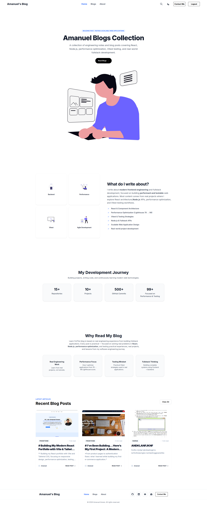
</p>

---

## Blog Details

<p align="center">
  
</p>

---

## Blogs Page

<p align="center">
  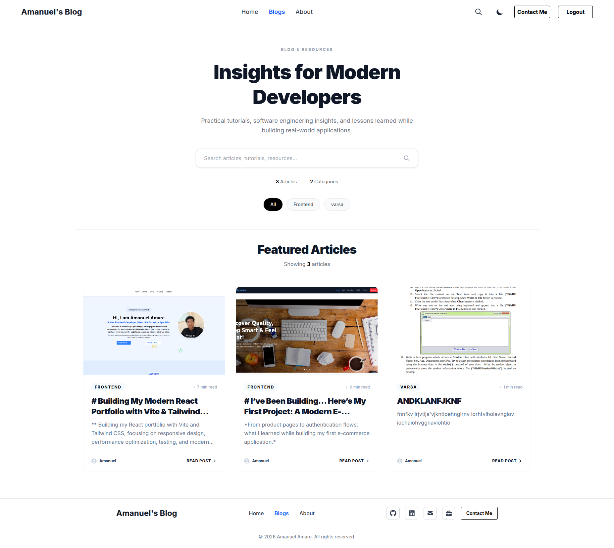
</p>

---

## About Page

<p align="center">
  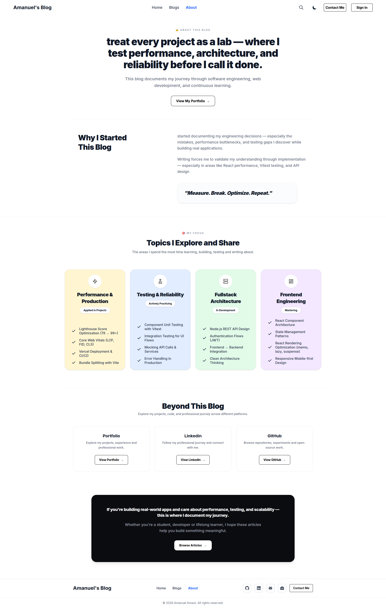
</p>

---

## Authentication

| Sign In                                                                        | Sign Up                                                                        |
| ------------------------------------------------------------------------------ | ------------------------------------------------------------------------------ |
| 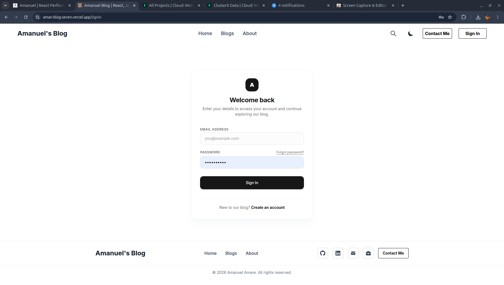 | 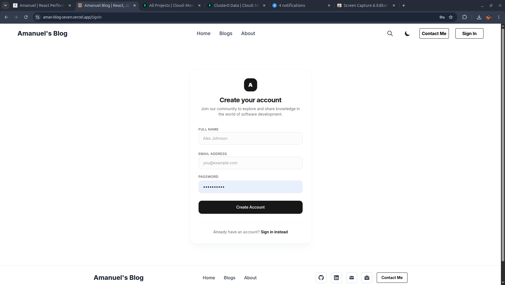 |

---

## Admin Dashboard

<p align="center">
  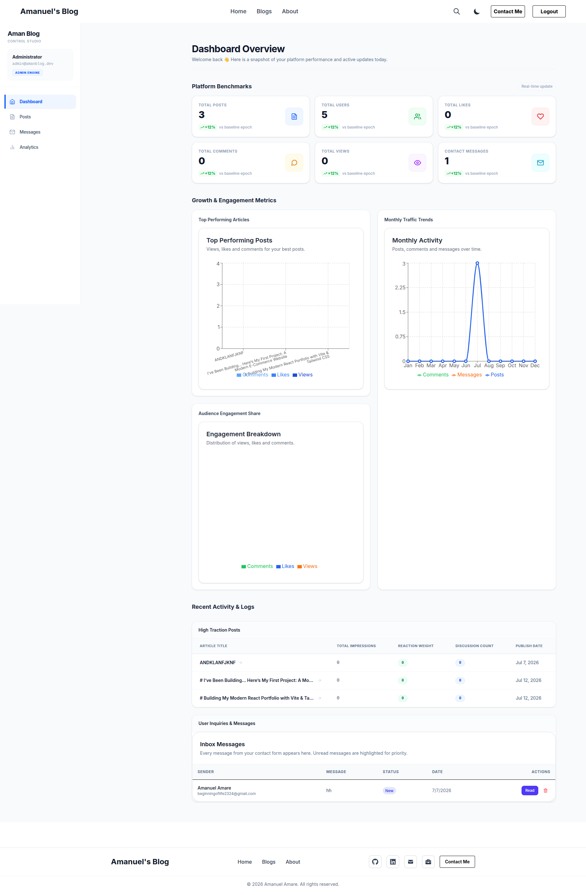
</p>

---

## Admin Messages

<p align="center">
  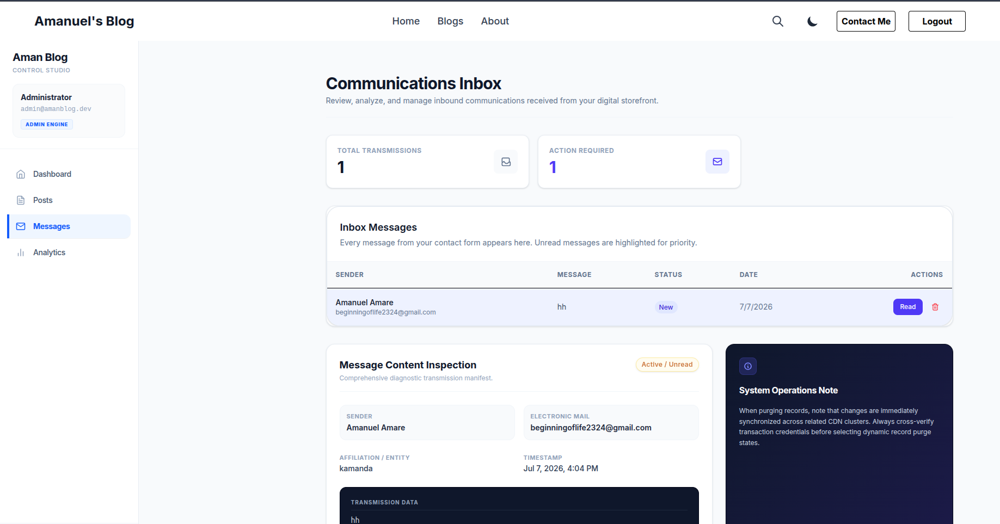
</p>

---

## Admin Analytics

<p align="center">
  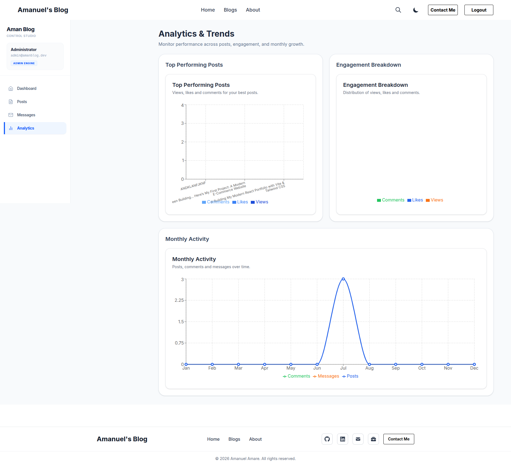
</p>

---

## Admin Posts

<p align="center">
  
</p>

---

## Create Post

<p align="center">
  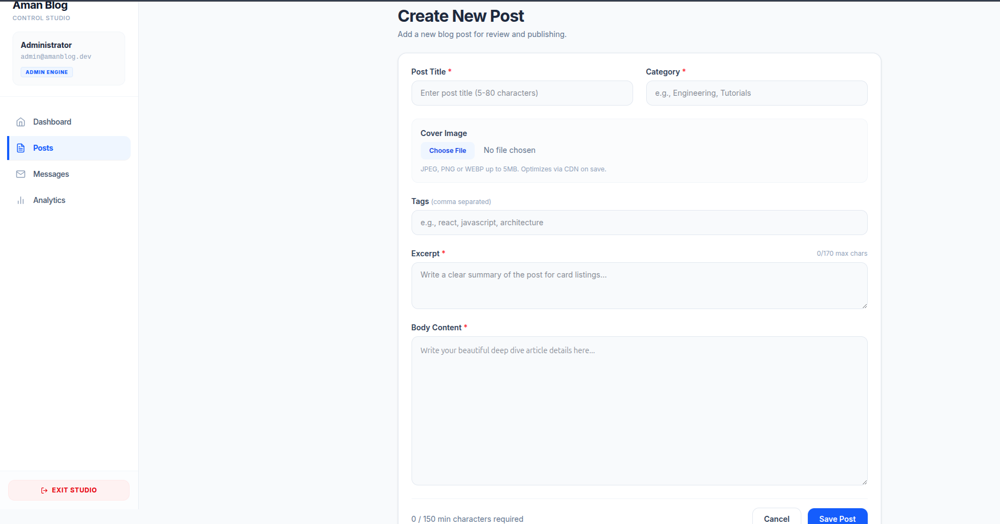
</p>

---

## Contact System

<p align="center">
  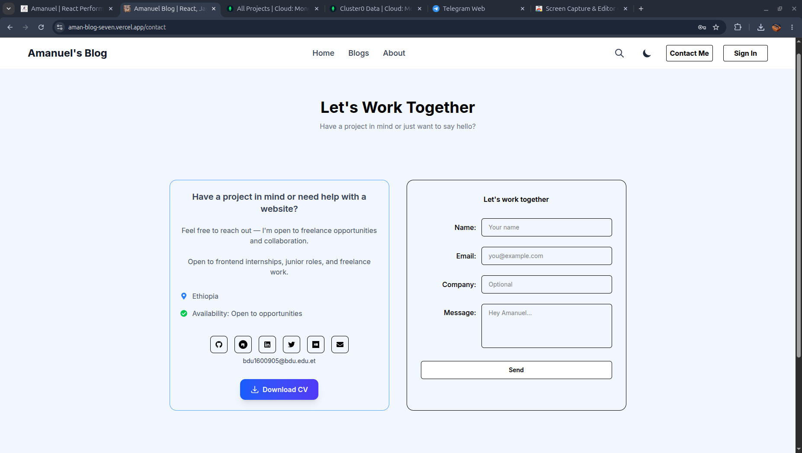
</p>

---

# Testing

Aman Blog includes automated testing for both the frontend and backend applications.

The testing strategy focuses on verifying user behavior, application logic, API behavior, validation, authentication, and important application flows.

## Frontend Test Result

<p align="center">
  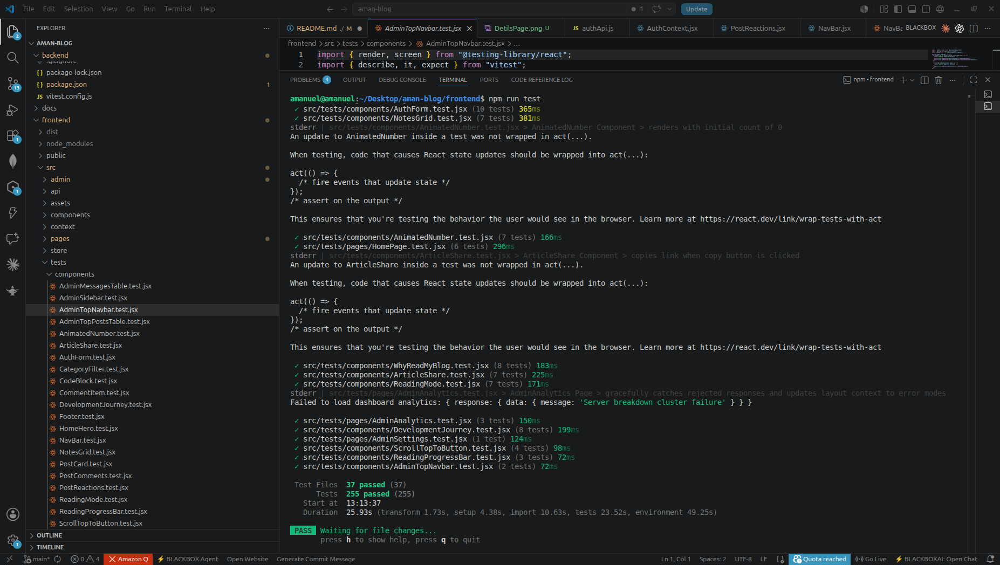
</p>

The frontend test suite uses:

* Vitest
* React Testing Library
* `@testing-library/user-event`
* jsdom

Tests cover component behavior, user interactions, forms, authentication flows, navigation, blog functionality, and application states.

---

## Backend Testing

The backend testing system uses **Vitest** and **Supertest** to verify API behavior, validation, authentication, and backend functionality.

### Backend Test Result

<p align="center">
  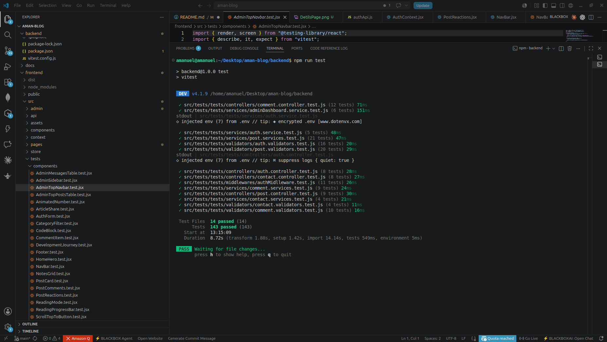
</p>

Backend tests cover areas such as:

* REST API endpoints
* Authentication
* Authorization
* Request validation
* Blog operations
* Comments
* Contact functionality
* Error handling
* API responses

### Testing Scale

**51 test files · 398 assertions**

Testing is treated as part of the development workflow rather than only as a final verification step.

```text
Feature
   ↓
Implementation
   ↓
Automated Tests
   ↓
Failure / Debugging
   ↓
Fix
   ↓
Regression Testing
   ↓
Refactor
```

# API Overview

Aman Blog exposes a REST API that handles authentication, users, blog content, community interactions, administration, media, and contact functionality.

The API follows a layered backend architecture:

```text
HTTP Request
     ↓
Route
     ↓
Middleware
     ↓
Validation
     ↓
Controller
     ↓
Service
     ↓
Model
     ↓
MongoDB
     ↓
HTTP Response
```

## API Areas

| Area           | Responsibilities                                       |
| -------------- | ------------------------------------------------------ |
| Authentication | Registration, login, logout, session management        |
| OAuth          | Google authentication and OAuth callback handling      |
| Users          | User information and authenticated user operations     |
| Posts          | Create, read, update, publish, and delete posts        |
| Comments       | Comments, replies, editing, deletion, and interactions |
| Reactions      | Post and comment reactions                             |
| Views          | Blog view tracking                                     |
| Admin          | Content, users, comments, messages, and analytics      |
| Contact        | Contact form submission and message management         |
| Media          | Image upload and Cloudinary integration                |

## Authentication API

Authentication uses JWT-based sessions with HTTP-only cookies.

Typical flow:

```text
POST /auth/register
        ↓
Create User
        ↓
Hash Password
        ↓
Create Session
        ↓
Authenticated User
```

Login follows a similar process:

```text
POST /auth/login
        ↓
Validate Credentials
        ↓
Verify Password
        ↓
Create JWT
        ↓
HTTP-only Cookie
        ↓
Authenticated Requests
```

Google OAuth provides an additional authentication path that connects externally authenticated users to the application's user/session system.

## Blog API

The blog API handles the complete content lifecycle:

```text
Create
  ↓
Edit
  ↓
Publish
  ↓
Read
  ↓
Interact
  ↓
Update / Delete
```

Blog-related functionality includes:

* Post creation
* Post editing
* Publishing
* Post retrieval
* Pagination
* Search
* Categories
* Related content
* View tracking
* Reactions
* Comments and replies
* Media references

## Community API

The API supports user-generated interactions around blog content.

```text
Post
 ├── Comments
 │     └── Replies
 │
 └── Reactions
```

Operations include creating, editing, deleting, and interacting with comments while applying authentication and permission checks where required.

## Admin API

Administrative endpoints are protected by authentication and authorization.

The admin system provides API functionality for:

* Managing posts
* Managing users
* Managing comments
* Managing contact messages
* Viewing application analytics
* Managing published content

The frontend does not determine whether an operation is authorized; protected API operations are enforced on the backend.

## Contact API

The contact system allows visitors to submit messages through the public application.

```text
Contact Form
     ↓
POST Request
     ↓
Validation
     ↓
Controller
     ↓
Database
     ↓
Admin Dashboard
```

Administrators can then access submitted messages through the admin interface.

## Media API Flow

Image uploads use multipart requests and are processed through the backend before being stored externally.

```text
Client
  ↓
Multipart Request
  ↓
Multer
  ↓
Validation
  ↓
Cloudinary
  ↓
Image URL
  ↓
MongoDB
```

The database stores references to hosted media rather than the raw image files.

## API Testing

API behavior is tested using **Vitest** and **Supertest**.

Testing includes:

* Successful requests
* Authentication failures
* Authorization failures
* Invalid input
* Resource operations
* Error responses
* Protected endpoints

This provides regression protection when backend functionality is changed or refactored.

## API Design Principles

The backend follows several practical API principles:

* Clear route responsibilities
* Consistent request/response handling
* Backend validation
* Authentication middleware
* Authorization checks
* Separation of controllers and business logic
* Centralized reusable services
* Controlled error responses
* Environment-based configuration
* Automated API testing

# What This Project Demonstrates

Aman Blog represents practical experience building and maintaining a full-stack application beyond a basic CRUD implementation.

### Full-Stack Development

* Building responsive React applications with Vite
* Designing and consuming REST APIs
* Developing Node.js and Express backends
* Working with MongoDB and Mongoose
* Connecting frontend, backend, database, and external services

### Backend Engineering

* Layered backend architecture
* REST API design
* Authentication and authorization
* JWT and HTTP-only cookie sessions
* Google OAuth integration
* Request validation and error handling
* File upload processing
* External service integration

### Frontend Engineering

* Reusable React components
* Application state management
* Client-side routing
* API service abstraction
* Responsive UI development
* Loading and error states
* Markdown-based content rendering
* Rich Markdown editing with Milkdown

### Quality Engineering

* 51 automated test files
* 398 test assertions
* Component and user-interaction testing
* REST API integration testing
* Regression testing
* Test-driven debugging and refactoring

### Performance Engineering

* Lazy loading
* Code splitting
* Rendering optimization
* API request optimization
* Pagination
* Image optimization
* Runtime caching
* PWA performance considerations
* Measurement-driven optimization

### Production Engineering

* Vercel frontend deployment
* Render backend deployment
* MongoDB Atlas
* Cloudinary media storage
* Gmail/Nodemailer email workflows
* Environment-based configuration
* Production debugging
* Cross-origin configuration

### Modern Web Development

* Progressive Web App architecture
* Service workers
* Web App Manifest
* Runtime caching
* SEO metadata
* Open Graph
* Structured data
* Responsive and accessible interfaces

## The Bigger Lesson

Building Aman Blog taught me that full-stack development is not simply connecting a frontend to a database.

A production application requires multiple engineering concerns to work together:

```text id="q2n7yc"
User Experience
       +
Frontend Architecture
       +
Backend Architecture
       +
Database Design
       +
Authentication
       +
Testing
       +
Performance
       +
Security
       +
Deployment
       +
Maintenance
       ↓
Production Application
```

The project represents my progression from building individual features toward thinking about applications as complete systems.

# Connect & Project Links

If you'd like to explore the project, review the implementation, or discuss potential collaboration, these are the main links.

### Aman Blog

* **Live Application:** https://aman-blog-seven.vercel.app
* **Source Code:** https://github.com/amanuel1221/aman-blog
* **Backend API:** https://aman-blog-8jg2.onrender.com

### Developer

* **Portfolio:** https://amanuel-portfolio-flame.vercel.app
* **GitHub:** https://github.com/amanuel1221
* **LinkedIn:** https://www.linkedin.com/in/amanuel-amare-684234372
* **Email:** [bdu1600905@bdu.edu.et](mailto:bdu1600905@bdu.edu.et)

---

### About Me

I'm **Amanuel Amare**, a Software Engineering student at Bahir Dar University and a Full Stack Developer focused on performance, testing, and maintainable application architecture.

I enjoy building real applications, investigating performance bottlenecks, writing automated tests, and continuously improving the architecture behind the product.

**Build → Test → Measure → Improve.**

